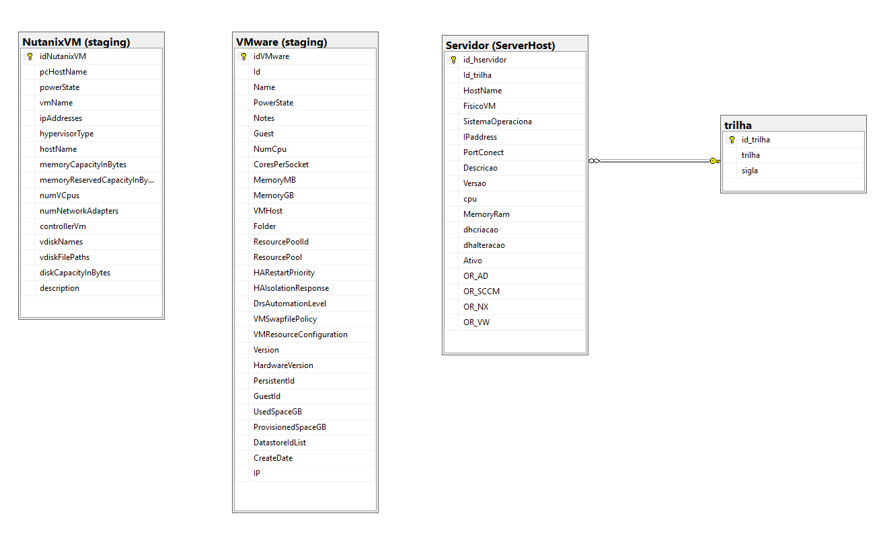

# Estrutura de dados.

Como os dados são transferidos por completos a cada carga, as tabelas não são normalizadas sendo assim não existes chave estrangeira entre elas.

### Tabelas
|Schemas  |Tabelas   |Descrição  |
|---|----|-----|
|dbo | trilha | As trilhas dos ambientes "Produção","Homologação"....|
|ServerHost | Servidor | A relação consolidade das VM. |
|staging | NutanixVM | Carga temporária Nutanix |  
|staging | VMware    | Carga temporária VMware |

<p></p>
<p></p>

### Diagrama.


### Consolidando dos dados.
A consolidação das duas origens VMware e Nutanix são executadas através das Stored Procedures:

|Schema  |Stored Procedure                     | Descrição    |
|--------|-------------------------------------|--------------|
|staging |SP_carga_nx_ServerHost_Servidor      | Executar carga de dados nas tabelas <b>ServerHost.Servidor</b> |
|staging |SP_carga_VMware_ServerHost_Servidor  | Executar carga de dados nas tabelas <b>ServerHost.Servidor</b> |


### Executa a consolidação das VM
A consolidação será executada em duas etapas:

1. Execução das Stored Procedures.
2. Apagar as VM que foram deletas na origem.


#### Execução das Stored Procedures.
````
DECLARE @RC int

EXECUTE @RC = [dbo].[SP_carga_nx_ServerHost_Servidor] 
EXECUTE @RC = [dbo].[SP_carga_VMware_ServerHost_Servidor] 
````

##### Apagar as VM que foram deletas na origem.
````
DELETE SH FROM [ServerHost].[Servidor] AS SH
	LEFT JOIN [staging].[sccm_vw_server_host] SC
		ON RTRIM(LTRIM(SH.[HostName])) = RTRIM(LTRIM(SC.[HostName]))
	LEFT JOIN [staging].[VMware] AS VW
		ON RTRIM(LTRIM(SH.[HostName])) = RTRIM(LTRIM(VW.[Name]))
	LEFT JOIN [staging].[NutanixVM] AS NX
		ON RTRIM(LTRIM(SH.[HostName])) = RTRIM(LTRIM(NX.[vmName]))
	LEFT JOIN [staging].[ADComputer] AD
		ON RTRIM(LTRIM(SH.[HostName])) = RTRIM(LTRIM(AD.[Name]))
WHERE SC.HostName IS NULL
AND VW.Name IS NULL
AND NX.vmName IS NULL
AND AD.Name IS NULL
````

## Criando a base de dados.

Execute os scripts no servidor de banco de dados:
1. [00_create_database.sql](/base_de_dados/00_create_database.sql)
1. [01_create_schemas.sql](/base_de_dados/01_create_schemas.sql)
1. [02_create_tables_sp.sql](/base_de_dados/02_create_tables_sp.sql)
